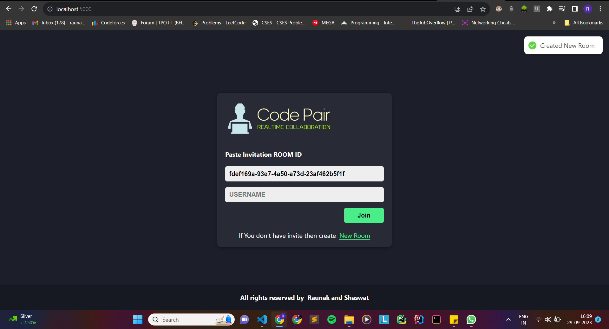
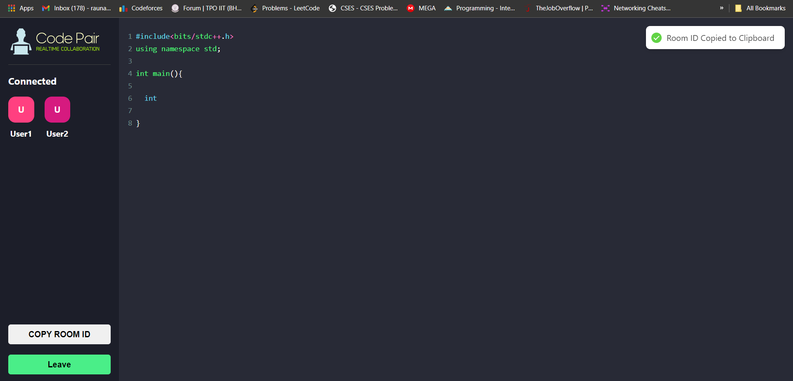

# Code-Pair

## Overview

Code Pair is a web-based application that enables multiple users to collaborate in real time on code editing. It offers a seamless and interactive environment for developers, students, or teams to work on code together and observe each other's changes instantly.

## Features

- Real-time code editing with live synchronization.
- Multi-user support for collaborative coding.
- Code highlighting and auto-indentation.
- User-friendly chat interface for communication.
- Room creation and joining with unique room IDs.
- Notification system for important events.

## Table of Contents

- [Screenshots](#screenshots)
- [Getting Started](#getting-started)
- [Technologies Used](#technologies-used)
- [Contributing](#contributing)

## Screenshots


*Login Page*


*Editing Page*


## Getting Started

Follow these steps to set up and run the project locally:

1. Clone the repository:

   ```bash
    git clone https://github.com/Raunik2/Code_Pair.git

2. Navigate to the project directory:
   
   ```bash
   cd Code_Pair

4. Install dependencies:
   
   ```bash
   npm install

6. Start the application:
   
   ```bash
   npm start
   
7. Open your web browser and navigate to the following URL:
   
   ```bash
   http://localhost:5000

8. Create a new room or join an existing room with a unique Room ID:
9. Collaborate with others in real time by editing code and using the chat interface.
10. Enjoy seamless code editing and communication!

## Technologies Used
- React
- Socket.io
- CodeMirror
- react-hot-toast
- uuid

## Contributing
Contributions are welcome! To contribute to this project:

- Fork the repository.
- Create a new branch for your feature or bug fix.
- Make your changes and commit them.
- Push your changes to your fork.
- Open a pull request with a clear title and description.
